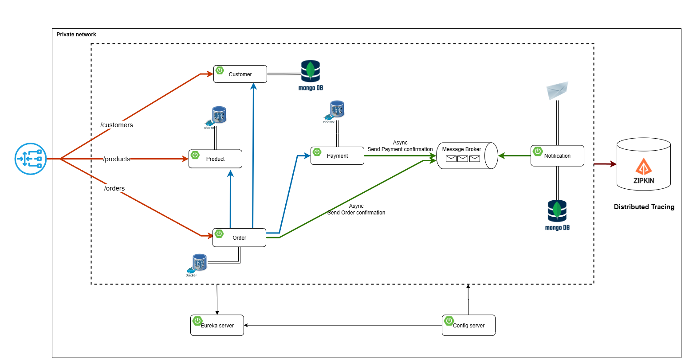

# ⚙️ Enterprise-Grade Ecommerce Microservices Platform with Spring Boot

## 📌 Overview
This project is a **robust, scalable, and cloud-native Ecommerce Platform** designed with a modular **microservices architecture** using **Spring Boot**. Each core domain (**Customer**, **Product**, **Order**, **Payment**, **Notification**) is developed as an independent, decoupled service, enabling high flexibility, fault isolation, and seamless scaling.

The system harnesses **Docker Compose** to orchestrate services and integrates cutting-edge infrastructure tools like **Kafka**, **Keycloak**, and **Zipkin** to ensure reliability, security, and observability. This architecture lays the foundation for a production-ready, enterprise-grade solution suitable for modern e-commerce ecosystems.

## 🛠️ Technologies Used
- **Spring Boot** (Microservices backend)
- **Spring Cloud** (Service discovery, config server, gateway)
- **PostgreSQL** (Relational database)
- **MongoDB** (NoSQL database)
- **Kafka** (Event streaming)
- **Keycloak** (Authentication & Authorization)
- **Docker Compose** (Service orchestration)
- **PgAdmin** (PostgreSQL management)
- **Mongo Express** (MongoDB management)
- **MailDev** (Email testing)
- **Zipkin** (Distributed tracing)
- **Zookeeper** (Kafka coordination)

## 🖼️ Architecture Diagram

You can view the system architecture in the diagram below:



> **Note:** Each microservice (**Product**, **Customer**, **Order**, **Payment**, **Notification**) uses its own dedicated database. For example, some services may use **PostgreSQL**, while others rely on **MongoDB**.
>
> All database and service-specific configurations are managed centrally through the **Spring Cloud Config Server**, allowing you to define and maintain each service’s settings (like environment variables and `application.yml` values) from a single location.

---

## 🚀 Getting Started

### 1️⃣ Prerequisites
Make sure you have installed:
- [Docker & Docker Compose](https://docs.docker.com/get-docker/)
- [Java 17+](https://adoptopenjdk.net/)
- [Maven](https://maven.apache.org/install.html)

### 2️⃣ Configure Environment Variables
Create a `.env` file in the root directory and set the following variables:

```env
# PostgreSQL
POSTGRES_USER=your_pg_user
POSTGRES_PASSWORD=your_pg_password
POSTGRES_DB=app_db

# MongoDB
MONGO_INITDB_ROOT_USERNAME=your_mongo_user
MONGO_INITDB_ROOT_PASSWORD=your_mongo_password

# PgAdmin
PGADMIN_DEFAULT_EMAIL=admin@admin.com
PGADMIN_DEFAULT_PASSWORD=admin

# Keycloak
KEYCLOAK_ADMIN=admin
KEYCLOAK_ADMIN_PASSWORD=admin

# Kafka
KAFKA_ADVERTISED_LISTENERS=PLAINTEXT://localhost:9092
KAFKA_PROCESS_ROLES=broker
KAFKA_CLUSTER_ID=1
KAFKA_NODE_ID=1

# Zookeeper
ZOOKEEPER_SERVER_ID=1
```

### 3️⃣ Start All Services
Run the following command to start the entire stack:

```sh
docker-compose up -d
```

This will start:
- PostgreSQL & PgAdmin
- MongoDB & Mongo Express
- Kafka & Zookeeper
- Keycloak
- MailDev
- Zipkin
- All microservices (start them individually with Maven as needed)

### 4️⃣ Set Environment Variables
Each microservice requires specific environment variables to be set. You can assign your own values or use the provided defaults in the `docker-compose.yml` file. For local development, create a `.env` file in each service directory or set the variables directly in your environment. Refer to each service's documentation for required variables.

Additionally, for each service, ensure you add the following configuration to the `application.yml` file:

```yaml
spring:
  application:
    name: <service-name>
  config:
    import: optional:configserver:${CONFIG_SERVER_URL}
```
Replace `<service-name>` with the actual name of the service (e.g., `payment-service`, `order-service`, etc.).

### 5️⃣ Access Services
- **API Gateway**: http://localhost:8080
- **PgAdmin**: http://localhost:5050
- **Mongo Express**: http://localhost:8081
- **Keycloak Admin Console**: http://localhost:9098
- **MailDev**: http://localhost:1080
- **Zipkin**: http://localhost:9411

### 6️⃣ Stop All Services
To stop and remove all containers, run:
```sh
docker-compose down
```

---

## 🔒 Authentication & Security
Authentication is managed by **Keycloak**. Configure realms, clients, and roles as needed for your application. Each microservice can be secured using OAuth2 and JWT tokens.

---

## 🛠️ Development
### Run a Microservice Locally (Without Docker)
1. Start the required infrastructure services (PostgreSQL, MongoDB, Keycloak, etc.) via Docker Compose.
2. Configure the microservice's `application.yml` with the correct connection settings.
3. In the service directory, run:
   ```sh
   mvn spring-boot:run
   ```

---

## 📜 License
This project is licensed under the [MIT License](LICENSE).

---

## 📩 Contact
For questions or contributions, please open an issue or submit a pull request!